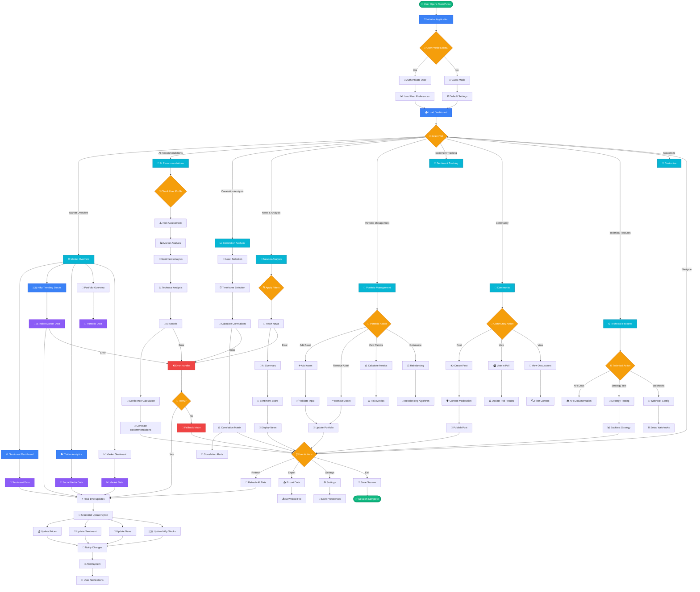

# TrendPulse Pro - Comprehensive Market Intelligence Platform


## 🚀 Overview

TrendPulse Pro is a comprehensive financial analytics platform that provides real-time market intelligence, sentiment analysis, portfolio management, and AI-powered stock recommendations. Built with React, TypeScript, and Tailwind CSS, it offers institutional-grade analysis capabilities in a user-friendly interface.

## 📋 Table of Contents

- [Features](#features)
- [Complete Workflow Diagram](#complete-workflow-diagram)
- [File Structure & Dependencies](#file-structure--dependencies)
- [Component Architecture](#component-architecture)
- [Data Flow](#data-flow)
- [API Integration](#api-integration)
- [Real-time Updates](#real-time-updates)
- [Installation](#installation)
- [Contributing](#contributing)

## ✨ Features

### 🎯 Market Overview Dashboard
- **Comprehensive Sentiment Dashboard**: Multi-source sentiment analysis with real-time updates
- **Nifty Trending Stocks**: Live Indian stock market data with news-driven insights
- **Twitter Analytics**: Social media sentiment tracking and trending topics
- **Portfolio Overview**: Quick portfolio summary with P&L tracking
- **Market Sentiment**: Overall market mood analysis with correlation matrices

### 🤖 AI Stock Recommendation System
- **Multi-source Analysis**: Technical indicators, sentiment analysis, news coverage
- **Confidence Scoring**: 0-100% confidence with transparent methodology
- **User Profiling**: Risk tolerance, investment horizon, sector preferences
- **Real-time Updates**: Live data integration with 5-second refresh cycles

### 📊 Advanced Analytics
- **Correlation Analysis**: Real-time correlation matrices between assets
- **Sentiment Heatmap**: Color-coded sentiment visualization
- **News Aggregation**: AI-summarized news from 50+ sources
- **Technical Features**: Trading strategy testing and API integration

### 💼 Portfolio Management
- **Advanced Portfolio**: Risk metrics, diversification analysis
- **Rebalancing Recommendations**: AI-powered portfolio optimization
- **Performance Tracking**: Sharpe ratio, volatility, beta calculations
- **Virtual Trading**: Paper trading with real market data

### 🌐 Community Features
- **Discussion Forums**: Asset-specific community discussions
- **Live Polling**: Market sentiment polls and voting
- **Privacy Controls**: Granular privacy settings
- **Social Sentiment**: Influencer tracking and community engagement

## 📊 Complete Workflow Diagram

### System Architecture & Data Flow



### Legend

| Symbol | Meaning | Description |
|--------|---------|-------------|
| 🟢 **Oval** | Start/End Points | Application entry and exit points |
| 🔵 **Rectangle** | Process | Data processing, calculations, API calls |
| 🟡 **Diamond** | Decision | Conditional logic, user choices |
| 🟣 **Parallelogram** | Data | Data storage, retrieval, updates |
| 🔴 **Rectangle** | Error Handling | Error states and recovery |
| 🔵 **Tab Rectangle** | Tab Components | Dashboard tab navigation |

## 📁 File Structure & Dependencies

### Core Application Files

```
src/
├── App.tsx                          # Main application entry point
├── main.tsx                         # React DOM rendering
├── index.css                        # Global styles and Tailwind CSS
└── vite-env.d.ts                   # Vite environment types
```

### Component Architecture

```
src/components/
├── ComprehensiveDashboard.tsx       # Main dashboard container
│   ├── Uses: All tab components
│   ├── Manages: Tab state, data export, theme
│   └── Integrates: useRealTimeData hook
│
├── Market Overview Tab Components:
│   ├── SentimentDashboard.tsx       # Comprehensive sentiment analysis
│   ├── NiftyTrending.tsx           # Indian stock market data
│   ├── TwitterAnalytics.tsx        # Social media sentiment
│   ├── MarketSentiment.tsx         # Overall market mood
│   └── Portfolio.tsx               # Portfolio overview
│
├── AI Recommendations:
│   └── StockRecommendationSystem.tsx # AI-powered stock recommendations
│       ├── Uses: UserProfile, StockRecommendation types
│       ├── Features: Confidence scoring, risk assessment
│       └── Integrates: Multiple data sources
│
├── Analytics Components:
│   ├── CorrelationAnalysis.tsx     # Asset correlation matrices
│   ├── NewsAggregation.tsx         # AI news analysis
│   ├── SentimentHeatmap.tsx        # Sentiment visualization
│   └── TrendVisualization.tsx      # Trend analysis charts
│
├── Portfolio Management:
│   └── AdvancedPortfolio.tsx       # Advanced portfolio tools
│       ├── Features: Risk metrics, rebalancing
│       ├── Uses: PortfolioAsset, RiskMetrics types
│       └── Integrates: ExportModal
│
├── Community Features:
│   ├── CommunityFeatures.tsx       # Social trading features
│   ├── SmartAlerts.tsx            # Intelligent alert system
│   └── PersonalizationPanel.tsx   # User customization
│
├── Technical Features:
│   ├── TechnicalFeatures.tsx       # API docs, strategy testing
│   └── DashboardCustomization.tsx  # Layout customization
│
└── Utility Components:
    ├── AlertSystem.tsx             # Notification system
    ├── SearchBar.tsx              # Asset search functionality
    ├── ExportModal.tsx            # Data export functionality
    ├── ThemeToggle.tsx            # Theme switching
    ├── KeyboardShortcuts.tsx      # Keyboard navigation
    ├── LiveDataIndicator.tsx      # Connection status
    ├── QuickActions.tsx           # Floating action menu
    ├── Header.tsx                 # Application header
    ├── NewsFeed.tsx              # Live news updates
    └── MarketInsights.tsx         # Market analysis insights
```

### Data Management

```
src/hooks/
└── useRealTimeData.ts              # Central data management hook
    ├── Manages: All real-time data updates
    ├── Provides: Market data, portfolio, sentiment
    ├── Features: 5-second update cycles
    └── Used by: ComprehensiveDashboard
```

```
src/utils/
└── mockData.ts                     # Mock data generators
    ├── generateTrendingTopics()     # Social media trends
    ├── generateNiftyStocks()        # Indian market data
    ├── generateNewsArticles()       # News articles
    ├── generateSentimentHeatmap()   # Sentiment data
    ├── generateMarketSentiment()    # Market mood
    ├── generatePortfolioAssets()    # Portfolio data
    └── simulateRealTimeUpdate()     # Real-time simulation
```

```
src/types/
└── index.ts                        # TypeScript type definitions
    ├── Core Types: TrendingTopic, PortfolioAsset, MarketSentiment
    ├── Indian Market: NiftyStock
    ├── News: NewsArticle
    ├── Analytics: CorrelationData, SentimentHeatmapData
    ├── AI System: StockRecommendation, UserProfile
    ├── Community: CommunityPost, Poll
    └── Technical: TradingStrategy, SmartAlert
```

### Configuration Files

```
Root Directory:
├── package.json                    # Dependencies and scripts
├── vite.config.ts                 # Vite configuration
├── tailwind.config.js             # Tailwind CSS configuration
├── tsconfig.json                  # TypeScript configuration
├── tsconfig.app.json              # App-specific TypeScript config
├── tsconfig.node.json             # Node-specific TypeScript config
├── postcss.config.js              # PostCSS configuration
├── eslint.config.js               # ESLint configuration
└── index.html                     # HTML template
```

## 🔄 Data Flow Architecture

### Real-time Data Pipeline

```
Data Sources → useRealTimeData Hook → Components → UI Updates
     ↓              ↓                    ↓           ↓
1. Mock APIs    2. State Management   3. Props    4. Re-render
2. Generators   2. 5s Update Cycle    3. Context  4. Animations
3. Simulators   2. Error Handling     3. Events   4. Notifications
```

### Component Communication

```
ComprehensiveDashboard (Parent)
├── Manages global state and tab navigation
├── Provides data to all child components
├── Handles user actions (refresh, export, theme)
└── Coordinates real-time updates

Child Components (Tabs)
├── Receive data via props
├── Handle local state and user interactions
├── Emit events back to parent
└── Update UI based on data changes
```

### State Management Flow

```
useRealTimeData Hook:
├── Initializes all data sources
├── Sets up 5-second update intervals
├── Simulates real-time market changes
├── Provides data to dashboard
└── Handles add/remove asset operations

Data Updates:
├── Trending Topics → Social sentiment changes
├── Nifty Stocks → Price and volume updates
├── Portfolio Assets → P&L calculations
├── Market Sentiment → Correlation updates
└── News Articles → New article generation
```

## 🌐 API Integration Points

### External Data Sources (Simulated)

```
Market Data APIs:
├── Indian Stock Exchange (NSE/BSE)
├── Cryptocurrency Exchanges
├── US Stock Markets (NYSE/NASDAQ)
└── Global Market Indices

Social Media APIs:
├── Twitter/X API for trending topics
├── Reddit API for community sentiment
├── Discord API for crypto discussions
└── Telegram API for trading groups

News APIs:
├── Bloomberg Terminal
├── Reuters News API
├── Economic Times API
├── Financial news aggregators
└── Company press releases

Technical Analysis:
├── TradingView API
├── Alpha Vantage API
├── Yahoo Finance API
└── Custom technical indicators
```

### Internal API Structure

```
/api/v1/
├── /market-data          # Real-time market prices
├── /sentiment/analysis   # Sentiment analysis results
├── /correlations        # Asset correlation data
├── /news               # News articles and analysis
├── /portfolio          # Portfolio management
├── /alerts             # Alert system
└── /recommendations    # AI recommendations
```

## ⚡ Real-time Updates System

### Update Mechanisms

```
Real-time Data Flow:
1. useRealTimeData Hook initializes
2. 5-second interval timer starts
3. simulateRealTimeUpdate() called
4. Random data changes applied
5. Components re-render automatically
6. UI updates with smooth animations
```

### Data Update Frequency

```
High Frequency (5 seconds):
├── Stock prices and volumes
├── Sentiment scores
├── Portfolio values
└── Trending topics

Medium Frequency (30 seconds):
├── News articles
├── Correlation matrices
└── Market sentiment

Low Frequency (5 minutes):
├── AI recommendations
├── Technical indicators
└── Risk metrics
```

### Performance Optimizations

```
Optimization Strategies:
├── React.memo for pure components
├── useMemo for expensive calculations
├── useCallback for event handlers
├── Debounced API calls
├── Efficient re-rendering
└── Memory leak prevention
```

## 🎨 UI/UX Architecture

### Design System

```
Theme Management:
├── Dark/Light/System themes
├── Consistent color palette
├── Responsive breakpoints
├── Smooth animations
└── Accessibility features

Component Patterns:
├── Card-based layouts
├── Glassmorphism effects
├── Hover state animations
├── Loading skeletons
└── Error boundaries
```

### User Interaction Flow

```
Navigation:
├── Tab-based main navigation
├── Breadcrumb navigation
├── Search functionality
├── Keyboard shortcuts
└── Quick action menu

Data Interaction:
├── Real-time data updates
├── Interactive charts
├── Filterable content
├── Sortable tables
└── Export functionality
```

## 🛠 Tech Stack

- **Frontend**: React 18, TypeScript, Tailwind CSS
- **Charts**: Recharts, Chart.js
- **Icons**: Lucide React
- **Animations**: Framer Motion
- **Build Tool**: Vite
- **Styling**: PostCSS, Autoprefixer

## 🚀 Installation

```bash
# Clone the repository
git clone https://github.com/your-username/trendpulse-pro.git

# Navigate to project directory
cd trendpulse-pro

# Install dependencies
npm install

# Start development server
npm run dev

# Build for production
npm run build

# Preview production build
npm run preview
```

## 🤝 Contributing

### Development Setup
1. Fork the repository
2. Create feature branch
3. Make changes with tests
4. Submit pull request

### Code Standards
- Follow TypeScript best practices
- Maintain component modularity
- Write comprehensive tests
- Document new features

---

**TrendPulse Pro** - Empowering intelligent investment decisions through comprehensive market intelligence.