# TrendPulse Pro - Comprehensive Market Intelligence Platform


## 🚀 Overview

TrendPulse Pro is a comprehensive financial analytics platform that provides real-time market intelligence, sentiment analysis, portfolio management, and AI-powered stock recommendations. Built with React, TypeScript, and Tailwind CSS, it offers institutional-grade analysis capabilities in a user-friendly interface.

## 📋 Table of Contents

- [Features](#features)
- [Workflow Diagram](#workflow-diagram)
- [Tech Stack](#tech-stack)
- [Installation](#installation)
- [Project Structure](#project-structure)
- [API Documentation](#api-documentation)
- [Data Flow](#data-flow)
- [Component Architecture](#component-architecture)
- [Dummy Data Implementation](#dummy-data-implementation)
- [Real-time Updates](#real-time-updates)
- [Contributing](#contributing)
- [License](#license)

## ✨ Features

### 🎯 AI Stock Recommendation System
- **Multi-source Analysis**: Technical indicators, sentiment analysis, news coverage
- **Confidence Scoring**: 0-100% confidence with transparent methodology
- **User Profiling**: Risk tolerance, investment horizon, sector preferences
- **Real-time Updates**: Live data integration with 5-second refresh cycles

### 📊 Market Analytics
- **Correlation Analysis**: Real-time correlation matrices between assets
- **Sentiment Heatmap**: Color-coded sentiment visualization
- **News Aggregation**: AI-summarized news from 50+ sources
- **Technical Features**: Trading strategy testing and API integration

### 💼 Portfolio Management
- **Advanced Portfolio**: Risk metrics, diversification analysis
- **Rebalancing Recommendations**: AI-powered portfolio optimization
- **Performance Tracking**: Sharpe ratio, volatility, beta calculations
- **Virtual Trading**: Paper trading with real market data

### 🌐 Community Features
- **Discussion Forums**: Asset-specific community discussions
- **Live Polling**: Market sentiment polls and voting
- **Privacy Controls**: Granular privacy settings
- **Social Sentiment**: Influencer tracking and community engagement

### 🔧 Technical Features
- **API Integration**: RESTful API with comprehensive documentation
- **Webhook Support**: Custom webhook configurations
- **Strategy Testing**: Backtesting environment for trading strategies
- **Real-time Data**: WebSocket connections for live updates

## 📊 Workflow Diagram

### Complete System Workflow

```mermaid
flowchart TD
    %% Start/End Points
    START([🚀 User Opens TrendPulse]) --> INIT
    END([✅ Session Complete])
    
    %% Initialization Process
    INIT[📱 Initialize Application] --> LOAD_PROFILE{👤 User Profile Exists?}
    LOAD_PROFILE -->|Yes| AUTH[🔐 Authenticate User]
    LOAD_PROFILE -->|No| GUEST[👥 Guest Mode]
    
    AUTH --> PROFILE_DATA[📊 Load User Preferences]
    GUEST --> DEFAULT_SETTINGS[⚙️ Default Settings]
    
    PROFILE_DATA --> DASHBOARD
    DEFAULT_SETTINGS --> DASHBOARD
    
    %% Main Dashboard
    DASHBOARD[🏠 Load Dashboard] --> COMPONENTS[🧩 Initialize Components]
    
    %% Component Initialization
    COMPONENTS --> RECO_INIT[🎯 Stock Recommendations]
    COMPONENTS --> CORR_INIT[📈 Correlation Analysis]
    COMPONENTS --> NEWS_INIT[📰 News Aggregation]
    COMPONENTS --> PORT_INIT[💼 Portfolio Management]
    COMPONENTS --> SENT_INIT[💭 Sentiment Analysis]
    COMPONENTS --> COMM_INIT[👥 Community Features]
    COMPONENTS --> TECH_INIT[⚙️ Technical Features]
    
    %% Real-time Data Flow
    RECO_INIT --> FETCH_DATA[📡 Fetch Initial Data]
    CORR_INIT --> FETCH_DATA
    NEWS_INIT --> FETCH_DATA
    PORT_INIT --> FETCH_DATA
    SENT_INIT --> FETCH_DATA
    COMM_INIT --> FETCH_DATA
    TECH_INIT --> FETCH_DATA
    
    FETCH_DATA --> WEBSOCKET[🔌 Establish WebSocket]
    WEBSOCKET --> REALTIME[⚡ Start Real-time Updates]
    
    %% User Interaction Flows
    REALTIME --> USER_ACTION{🖱️ User Action?}
    
    %% Stock Recommendation Flow
    USER_ACTION -->|Request Recommendations| RECO_FLOW[🎯 Recommendation Process]
    RECO_FLOW --> VALIDATE_PROFILE[✅ Validate User Profile]
    VALIDATE_PROFILE --> MARKET_DATA[📊 Fetch Market Data]
    MARKET_DATA --> SENTIMENT_ANALYSIS[💭 Analyze Sentiment]
    SENTIMENT_ANALYSIS --> TECHNICAL_ANALYSIS[📈 Technical Indicators]
    TECHNICAL_ANALYSIS --> AI_MODELS[🤖 Apply AI Models]
    AI_MODELS --> CONFIDENCE_CALC[🧮 Calculate Confidence]
    CONFIDENCE_CALC --> FILTER_RANK[🔍 Filter & Rank]
    FILTER_RANK --> DISPLAY_RECO[📋 Display Recommendations]
    DISPLAY_RECO --> USER_ACTION
    
    %% Portfolio Management Flow
    USER_ACTION -->|Manage Portfolio| PORT_FLOW[💼 Portfolio Process]
    PORT_FLOW --> ASSET_SELECTION{➕ Add/Remove Asset?}
    ASSET_SELECTION -->|Add| ADD_ASSET[➕ Add Asset Form]
    ASSET_SELECTION -->|Remove| REMOVE_ASSET[➖ Remove Asset]
    ASSET_SELECTION -->|View| CALC_METRICS[📊 Calculate Metrics]
    
    ADD_ASSET --> VALIDATE_INPUT[✅ Validate Input]
    VALIDATE_INPUT --> UPDATE_PORTFOLIO[🔄 Update Portfolio]
    REMOVE_ASSET --> UPDATE_PORTFOLIO
    CALC_METRICS --> RISK_ANALYSIS[⚠️ Risk Analysis]
    RISK_ANALYSIS --> REBALANCE_SUGGEST[⚖️ Rebalancing Suggestions]
    
    UPDATE_PORTFOLIO --> DISPLAY_PORT[📊 Display Portfolio]
    REBALANCE_SUGGEST --> DISPLAY_PORT
    DISPLAY_PORT --> USER_ACTION
    
    %% News & Sentiment Flow
    USER_ACTION -->|View News| NEWS_FLOW[📰 News Process]
    NEWS_FLOW --> FILTER_NEWS{🔍 Apply Filters?}
    FILTER_NEWS -->|Yes| SET_FILTERS[⚙️ Set Filters]
    FILTER_NEWS -->|No| FETCH_NEWS[📡 Fetch News]
    SET_FILTERS --> FETCH_NEWS
    FETCH_NEWS --> AI_SUMMARY[🤖 Generate AI Summary]
    AI_SUMMARY --> SENTIMENT_SCORE[💭 Calculate Sentiment]
    SENTIMENT_SCORE --> CATEGORIZE[📂 Categorize by Impact]
    CATEGORIZE --> DISPLAY_NEWS[📰 Display News Feed]
    DISPLAY_NEWS --> USER_ACTION
    
    %% Correlation Analysis Flow
    USER_ACTION -->|View Correlations| CORR_FLOW[📈 Correlation Process]
    CORR_FLOW --> SELECT_ASSETS[🎯 Select Assets]
    SELECT_ASSETS --> SELECT_TIMEFRAME[⏰ Select Timeframe]
    SELECT_TIMEFRAME --> CALC_CORRELATIONS[🧮 Calculate Correlations]
    CALC_CORRELATIONS --> GENERATE_MATRIX[📊 Generate Matrix]
    GENERATE_MATRIX --> DETECT_CHANGES[🔍 Detect Significant Changes]
    DETECT_CHANGES --> DISPLAY_CORR[📈 Display Correlations]
    DISPLAY_CORR --> USER_ACTION
    
    %% Community Features Flow
    USER_ACTION -->|Community| COMM_FLOW[👥 Community Process]
    COMM_FLOW --> COMM_ACTION{💬 Community Action?}
    COMM_ACTION -->|Post| CREATE_POST[✍️ Create Post]
    COMM_ACTION -->|Vote| VOTE_POLL[🗳️ Vote in Poll]
    COMM_ACTION -->|View| VIEW_DISCUSSIONS[👀 View Discussions]
    
    CREATE_POST --> MODERATE[🛡️ Content Moderation]
    MODERATE --> PUBLISH_POST[📢 Publish Post]
    VOTE_POLL --> UPDATE_POLL[📊 Update Poll Results]
    VIEW_DISCUSSIONS --> FILTER_CONTENT[🔍 Filter Content]
    
    PUBLISH_POST --> DISPLAY_COMM[👥 Display Community]
    UPDATE_POLL --> DISPLAY_COMM
    FILTER_CONTENT --> DISPLAY_COMM
    DISPLAY_COMM --> USER_ACTION
    
    %% Technical Features Flow
    USER_ACTION -->|Technical| TECH_FLOW[⚙️ Technical Process]
    TECH_FLOW --> TECH_ACTION{🔧 Technical Action?}
    TECH_ACTION -->|API Docs| SHOW_API[📚 Show API Documentation]
    TECH_ACTION -->|Strategy| STRATEGY_TEST[🧪 Strategy Testing]
    TECH_ACTION -->|Webhook| WEBHOOK_CONFIG[🔗 Webhook Configuration]
    
    STRATEGY_TEST --> SELECT_STRATEGY[🎯 Select Strategy]
    SELECT_STRATEGY --> SET_PARAMS[⚙️ Set Parameters]
    SET_PARAMS --> BACKTEST[📊 Run Backtest]
    BACKTEST --> DISPLAY_RESULTS[📈 Display Results]
    
    WEBHOOK_CONFIG --> CONFIG_WEBHOOK[⚙️ Configure Webhook]
    CONFIG_WEBHOOK --> TEST_WEBHOOK[🧪 Test Webhook]
    
    SHOW_API --> DISPLAY_TECH[⚙️ Display Technical]
    DISPLAY_RESULTS --> DISPLAY_TECH
    TEST_WEBHOOK --> DISPLAY_TECH
    DISPLAY_TECH --> USER_ACTION
    
    %% Settings & Customization Flow
    USER_ACTION -->|Settings| SETTINGS_FLOW[⚙️ Settings Process]
    SETTINGS_FLOW --> SETTINGS_ACTION{🔧 Settings Action?}
    SETTINGS_ACTION -->|Layout| CUSTOMIZE_LAYOUT[🎨 Customize Layout]
    SETTINGS_ACTION -->|Alerts| MANAGE_ALERTS[🔔 Manage Alerts]
    SETTINGS_ACTION -->|Privacy| PRIVACY_SETTINGS[🔒 Privacy Settings]
    
    CUSTOMIZE_LAYOUT --> SAVE_LAYOUT[💾 Save Layout]
    MANAGE_ALERTS --> CREATE_ALERT[➕ Create Alert]
    PRIVACY_SETTINGS --> UPDATE_PRIVACY[🔄 Update Privacy]
    
    SAVE_LAYOUT --> APPLY_SETTINGS[✅ Apply Settings]
    CREATE_ALERT --> APPLY_SETTINGS
    UPDATE_PRIVACY --> APPLY_SETTINGS
    APPLY_SETTINGS --> USER_ACTION
    
    %% Real-time Update Process
    REALTIME --> UPDATE_CYCLE[🔄 5-Second Update Cycle]
    UPDATE_CYCLE --> UPDATE_PRICES[💰 Update Prices]
    UPDATE_CYCLE --> UPDATE_SENTIMENT[💭 Update Sentiment]
    UPDATE_CYCLE --> UPDATE_NEWS[📰 Update News]
    UPDATE_CYCLE --> UPDATE_CORRELATIONS[📈 Update Correlations]
    
    UPDATE_PRICES --> NOTIFY_CHANGES[📢 Notify Changes]
    UPDATE_SENTIMENT --> NOTIFY_CHANGES
    UPDATE_NEWS --> NOTIFY_CHANGES
    UPDATE_CORRELATIONS --> NOTIFY_CHANGES
    
    NOTIFY_CHANGES --> TRIGGER_ALERTS{🔔 Trigger Alerts?}
    TRIGGER_ALERTS -->|Yes| SEND_ALERTS[📧 Send Alerts]
    TRIGGER_ALERTS -->|No| UPDATE_UI[🖥️ Update UI]
    SEND_ALERTS --> UPDATE_UI
    UPDATE_UI --> UPDATE_CYCLE
    
    %% Exit Flow
    USER_ACTION -->|Exit| SAVE_SESSION[💾 Save Session Data]
    SAVE_SESSION --> CLEANUP[🧹 Cleanup Resources]
    CLEANUP --> END
    
    %% Error Handling
    FETCH_DATA -->|Error| ERROR_HANDLER[❌ Error Handler]
    WEBSOCKET -->|Error| ERROR_HANDLER
    AI_MODELS -->|Error| ERROR_HANDLER
    ERROR_HANDLER --> RETRY{🔄 Retry?}
    RETRY -->|Yes| FETCH_DATA
    RETRY -->|No| FALLBACK[🔄 Fallback Mode]
    FALLBACK --> USER_ACTION
    
    %% Styling
    classDef startEnd fill:#10b981,stroke:#059669,stroke-width:3px,color:#fff
    classDef process fill:#3b82f6,stroke:#2563eb,stroke-width:2px,color:#fff
    classDef decision fill:#f59e0b,stroke:#d97706,stroke-width:2px,color:#fff
    classDef data fill:#8b5cf6,stroke:#7c3aed,stroke-width:2px,color:#fff
    classDef error fill:#ef4444,stroke:#dc2626,stroke-width:2px,color:#fff
    
    class START,END startEnd
    class INIT,DASHBOARD,COMPONENTS,REALTIME,DISPLAY_RECO,DISPLAY_PORT,DISPLAY_NEWS,DISPLAY_CORR,DISPLAY_COMM,DISPLAY_TECH process
    class LOAD_PROFILE,USER_ACTION,ASSET_SELECTION,FILTER_NEWS,COMM_ACTION,TECH_ACTION,SETTINGS_ACTION,TRIGGER_ALERTS,RETRY decision
    class PROFILE_DATA,MARKET_DATA,FETCH_DATA,UPDATE_PRICES,UPDATE_SENTIMENT,UPDATE_NEWS data
    class ERROR_HANDLER,FALLBACK error
```



### Legend

| Symbol | Meaning | Description |
|--------|---------|-------------|
| 🟢 **Oval** | Start/End Points | Application entry and exit points |
| 🔵 **Rectangle** | Process | Data processing, calculations, API calls |
| 🟡 **Diamond** | Decision | Conditional logic, user choices |
| 🟣 **Parallelogram** | Data | Data storage, retrieval, updates |
| 🔴 **Rectangle** | Error Handling | Error states and recovery |

### Key Workflow Components

#### 1. **Initialization Phase**
- **User Authentication**: Validates existing user or creates guest session
- **Profile Loading**: Retrieves user preferences and settings
- **Component Setup**: Initializes all dashboard components
- **Data Fetching**: Loads initial market data and configurations

#### 2. **Real-time Data Flow**
- **WebSocket Connection**: Establishes persistent connection for live updates
- **5-Second Cycles**: Continuous data refresh every 5 seconds
- **Change Detection**: Identifies significant market movements
- **Alert System**: Triggers notifications based on user preferences

#### 3. **User Interaction Flows**
- **Stock Recommendations**: Multi-step analysis pipeline with confidence scoring
- **Portfolio Management**: Asset management with risk analysis
- **News & Sentiment**: Filtered news feed with AI summarization
- **Correlation Analysis**: Dynamic correlation matrix generation
- **Community Features**: Social interaction and content moderation
- **Technical Features**: API documentation and strategy testing

#### 4. **Data Processing Pipeline**
- **Market Data**: Real-time price and volume updates
- **Sentiment Analysis**: Multi-source sentiment aggregation
- **Technical Indicators**: Momentum, volatility, and trend calculations
- **AI Models**: Machine learning predictions and confidence scoring

#### 5. **Error Handling & Recovery**
- **Graceful Degradation**: Fallback modes for service interruptions
- **Retry Logic**: Automatic retry mechanisms for failed requests
- **User Feedback**: Clear error messages and recovery options
- **Data Integrity**: Validation and consistency checks

### Stakeholders & Systems

#### **Primary Stakeholders**
- 👤 **End Users**: Investors, traders, analysts
- 🏢 **Financial Institutions**: Banks, hedge funds, investment firms
- 📊 **Data Providers**: Market data vendors, news agencies
- 🔧 **Developers**: Platform developers and API consumers

#### **External Systems**
- 📡 **Market Data APIs**: Real-time price and volume data
- 📰 **News APIs**: Financial news aggregation services
- 🐦 **Social Media APIs**: Twitter, Reddit sentiment data
- 🏦 **Exchange APIs**: Trading platform integrations
- 📧 **Notification Services**: Email, SMS, push notifications

#### **Internal Systems**
- 🤖 **AI/ML Models**: Recommendation algorithms
- 💾 **Database Systems**: User data and historical information
- 🔐 **Authentication**: User management and security
- 📊 **Analytics Engine**: Performance tracking and metrics
- 🔄 **Cache Layer**: Performance optimization

This comprehensive workflow diagram illustrates the complete user journey through the TrendPulse platform, from initial access to advanced feature utilization, including all decision points, data flows, and system interactions.

## 🛠 Tech Stack

- **Frontend**: React 18, TypeScript, Tailwind CSS
- **Charts**: Recharts, Chart.js
- **Icons**: Lucide React
- **Animations**: Framer Motion
- **Build Tool**: Vite
- **Styling**: PostCSS, Autoprefixer

## 🚀 Installation

```bash
# Clone the repository
git clone https://github.com/your-username/trendpulse-pro.git

# Navigate to project directory
cd trendpulse-pro

# Install dependencies
npm install

# Start development server
npm run dev

# Build for production
npm run build

# Preview production build
npm run preview
```

## 📁 Project Structure

```
src/
├── components/           # React components
│   ├── AdvancedPortfolio.tsx
│   ├── ComprehensiveDashboard.tsx
│   ├── CorrelationAnalysis.tsx
│   ├── NewsAggregation.tsx
│   ├── SentimentHeatmap.tsx
│   ├── StockRecommendationSystem.tsx
│   ├── TechnicalFeatures.tsx
│   └── CommunityFeatures.tsx
├── hooks/               # Custom React hooks
│   └── useRealTimeData.ts
├── types/               # TypeScript type definitions
│   └── index.ts
├── utils/               # Utility functions
│   └── mockData.ts
├── App.tsx             # Main application component
├── main.tsx            # Application entry point
└── index.css           # Global styles
```

## 🔌 API Documentation

### Base URL
```
https://api.trendpulse.com/v1
```

### Authentication
```bash
# Include API key in Authorization header
Authorization: Bearer YOUR_API_KEY
```

### Core Endpoints

#### 1. Stock Recommendations
```http
POST /api/v1/recommendations
Content-Type: application/json

{
  "userProfile": {
    "riskTolerance": "moderate",
    "investmentHorizon": "medium",
    "preferredSectors": ["technology", "healthcare"]
  },
  "investmentTimeframe": "medium",
  "maxRecommendations": 5
}
```

**Response:**
```json
{
  "recommendations": [
    {
      "id": "rec-1",
      "ticker": "NVDA",
      "companyName": "NVIDIA Corporation",
      "confidenceScore": 87,
      "category": "strong_buy",
      "keyMetrics": {
        "sentimentTrend24h": 15.2,
        "volumeChangePercent": 45.8,
        "mediaMentionFrequency": 234,
        "communityConsensusScore": 82
      },
      "technicalIndicators": {
        "trend5Day": "bullish",
        "volumePattern": "increasing",
        "volatilityLevel": "medium",
        "momentumScore": 78
      },
      "aiPrediction": {
        "priceTarget": 520,
        "timeHorizon": "3-6 months",
        "catalysts": ["AI chip demand surge", "Data center expansion"]
      },
      "reasoning": [
        "Strong AI chip demand driving revenue growth",
        "Positive earnings guidance and beat expectations"
      ],
      "risks": [
        "High valuation multiples",
        "Regulatory concerns in China market"
      ]
    }
  ],
  "metadata": {
    "totalAnalyzed": 1247,
    "confidenceMethodology": "Weighted average of technical, sentiment, and fundamental metrics"
  }
}
```

#### 2. Market Data
```http
GET /api/v1/market-data?symbols=BTC,ETH,AAPL&timeframe=1d&limit=100
```

**Response:**
```json
{
  "data": [
    {
      "symbol": "BTC",
      "price": 45000,
      "change24h": 2.5,
      "volume": 28500000000,
      "sentiment": 75,
      "timestamp": "2024-01-15T10:30:00Z"
    }
  ]
}
```

#### 3. Sentiment Analysis
```http
GET /api/v1/sentiment/analysis?assets=BTC,TSLA&sources=twitter,news&timeframe=24h
```

**Response:**
```json
{
  "sentimentData": [
    {
      "asset": "BTC",
      "sentiment": 75,
      "change24h": 5.2,
      "sources": {
        "twitter": 78,
        "news": 72,
        "reddit": 76
      },
      "volume": 15420,
      "trending": true
    }
  ]
}
```

#### 4. Correlation Analysis
```http
GET /api/v1/correlations?assets=BTC,ETH,AAPL,TSLA&timeframe=30d
```

**Response:**
```json
{
  "correlationMatrix": {
    "assets": ["BTC", "ETH", "AAPL", "TSLA"],
    "matrix": [
      [1.0, 0.85, 0.23, 0.45],
      [0.85, 1.0, 0.18, 0.52],
      [0.23, 0.18, 1.0, 0.67],
      [0.45, 0.52, 0.67, 1.0]
    ],
    "lastUpdated": "2024-01-15T10:30:00Z"
  }
}
```

#### 5. News Aggregation
```http
GET /api/v1/news?sources=bloomberg,reuters&sentiment=all&limit=20
```

**Response:**
```json
{
  "articles": [
    {
      "id": "news-1",
      "headline": "Bitcoin ETF Approval Drives Institutional Adoption",
      "summary": "Major financial institutions increase Bitcoin allocations...",
      "aiSummary": "ETF approval catalyzes institutional Bitcoin adoption",
      "source": "Bloomberg",
      "sentiment": 85,
      "impact": "high",
      "relatedAssets": ["BTC", "COIN", "MSTR"],
      "timestamp": "2024-01-15T09:30:00Z"
    }
  ]
}
```

#### 6. Portfolio Management
```http
POST /api/v1/portfolio/rebalance
Content-Type: application/json

{
  "targetWeights": {
    "BTC": 0.4,
    "ETH": 0.3,
    "AAPL": 0.2,
    "CASH": 0.1
  },
  "threshold": 0.05,
  "dryRun": false
}
```

#### 7. Alert Management
```http
POST /api/v1/alerts/create
Content-Type: application/json

{
  "asset": "BTC",
  "condition": "sentiment_threshold",
  "threshold": 80,
  "deliveryMethod": "email"
}
```

### WebSocket Endpoints

#### Real-time Market Data
```javascript
const ws = new WebSocket('wss://api.trendpulse.com/v1/ws/market-data');

ws.onmessage = (event) => {
  const data = JSON.parse(event.data);
  // Handle real-time updates
};

// Subscribe to specific assets
ws.send(JSON.stringify({
  action: 'subscribe',
  symbols: ['BTC', 'ETH', 'AAPL']
}));
```

#### Real-time Sentiment Updates
```javascript
const sentimentWs = new WebSocket('wss://api.trendpulse.com/v1/ws/sentiment');

sentimentWs.onmessage = (event) => {
  const sentimentUpdate = JSON.parse(event.data);
  // Update sentiment heatmap
};
```

## 🔄 Data Flow

### 1. Application Initialization


### 2. Recommendation Generation


### 3. Real-time Updates


## 🎭 Dummy Data Implementation

The platform uses sophisticated mock data generators to simulate real market conditions:

### Mock Data Generators

#### 1. Stock Recommendations (`generateRecommendations`)
```typescript
// Located in: src/components/StockRecommendationSystem.tsx
const mockRecommendations: StockRecommendation[] = [
  {
    ticker: 'NVDA',
    confidenceScore: 87,
    category: 'strong_buy',
    keyMetrics: {
      sentimentTrend24h: 15.2,
      volumeChangePercent: 45.8,
      mediaMentionFrequency: 234,
      communityConsensusScore: 82
    },
    // ... detailed analysis data
  }
];
```

#### 2. Market Sentiment (`generateMarketSentiment`)
```typescript
// Located in: src/utils/mockData.ts
export const generateMarketSentiment = (): MarketSentiment => {
  return {
    index: Math.floor(Math.random() * 100),
    trend: ['bullish', 'bearish', 'neutral'][Math.floor(Math.random() * 3)],
    volume: Math.floor(Math.random() * 1000000000),
    correlations: {
      'Crypto-Stocks': Math.random(),
      'BTC-ETH': Math.random(),
      // ... more correlations
    }
  };
};
```

#### 3. News Articles (`generateNewsArticles`)
```typescript
export const generateNewsArticles = (): NewsArticle[] => {
  const articles = [
    {
      headline: "Fed Signals Potential Rate Cuts as Inflation Cools",
      summary: "Federal Reserve officials hint at possible rate reductions...",
      aiSummary: "Fed considers rate cuts as inflation cools for third month",
      source: 'Bloomberg',
      sentiment: 75,
      impact: 'high',
      relatedAssets: ['SPY', 'QQQ', 'BTC']
    }
    // ... more articles
  ];
};
```

#### 4. Correlation Data (`generateCorrelationMatrix`)
```typescript
const generateCorrelationMatrix = () => {
  const assets = ['BTC', 'ETH', 'AAPL', 'TSLA', 'SPY'];
  const matrix: number[][] = [];
  
  for (let i = 0; i < assets.length; i++) {
    matrix[i] = [];
    for (let j = 0; j < assets.length; j++) {
      matrix[i][j] = i === j ? 1 : Math.random() * 2 - 1;
    }
  }
  
  return { assets, matrix, lastUpdated: new Date().toISOString() };
};
```

#### 5. Portfolio Assets (`generatePortfolioAssets`)
```typescript
export const generatePortfolioAssets = (): PortfolioAsset[] => {
  const assets = [
    { symbol: 'BTC', name: 'Bitcoin', purchasePrice: 45000 },
    { symbol: 'ETH', name: 'Ethereum', purchasePrice: 2800 },
    // ... more assets
  ];

  return assets.map((asset, index) => ({
    id: `asset-${index}`,
    ...asset,
    quantity: Math.random() * 10 + 0.1,
    currentPrice: asset.purchasePrice * (1 + (Math.random() - 0.5) * 0.3),
    change24h: (Math.random() - 0.5) * 10
  }));
};
```

### Real-time Simulation

#### Update Mechanism
```typescript
// Located in: src/hooks/useRealTimeData.ts
useEffect(() => {
  const interval = setInterval(() => {
    // Update trending topics
    setTrendingTopics(prev => 
      simulateRealTimeUpdate(prev, (topic) => ({
        ...topic,
        mentions: Math.max(0, topic.mentions + Math.floor((Math.random() - 0.5) * 1000)),
        sentiment: Math.max(0, Math.min(100, topic.sentiment + (Math.random() - 0.5) * 10))
      }))
    );

    // Update portfolio prices
    setPortfolioAssets(prev =>
      simulateRealTimeUpdate(prev, (asset) => ({
        ...asset,
        currentPrice: Math.max(0.01, asset.currentPrice * (1 + (Math.random() - 0.5) * 0.02))
      }))
    );
  }, 5000); // Update every 5 seconds

  return () => clearInterval(interval);
}, []);
```

## 🧮 Confidence Score Calculation

### Methodology
The confidence score is calculated using a weighted average of multiple factors:

```typescript
const calculateConfidenceScore = (recommendation: StockRecommendation): ConfidenceCalculation => {
  const weights = {
    technical: 0.25,      // Technical indicators
    sentiment: 0.20,      // Social sentiment analysis
    fundamental: 0.20,    // Fundamental metrics
    volume: 0.15,         // Volume patterns
    news: 0.10,          // News coverage
    community: 0.10,     // Community engagement
  };

  const scores = {
    technical: recommendation.technicalIndicators.momentumScore,
    sentiment: recommendation.socialSentiment.influencerSentiment,
    fundamental: recommendation.sectorPerformance.relativePeerRanking <= 3 ? 80 : 60,
    volume: recommendation.keyMetrics.volumeChangePercent > 20 ? 75 : 50,
    news: recommendation.keyMetrics.mediaMentionFrequency > 100 ? 80 : 60,
    community: recommendation.keyMetrics.communityConsensusScore,
  };

  const finalScore = Object.entries(weights).reduce((sum, [key, weight]) => {
    return sum + (scores[key as keyof typeof scores] * weight);
  }, 0);

  return {
    ...weights,
    finalScore: Math.round(finalScore),
    methodology: 'Weighted average of technical indicators, sentiment analysis, fundamental metrics, volume patterns, news coverage, and community engagement.'
  };
};
```

## 🔄 Component Lifecycle

### Dashboard Initialization
1. **App.tsx** renders **ComprehensiveDashboard**
2. **ComprehensiveDashboard** manages tab state and renders active components
3. Each component initializes with `useEffect` hooks
4. Mock data generators populate initial state
5. Real-time update intervals begin

### Data Update Flow
1. **useRealTimeData** hook manages global state
2. **simulateRealTimeUpdate** function applies random changes
3. Components subscribe to state changes via props
4. UI re-renders with new data automatically

### User Interactions
1. User actions trigger state updates
2. Components respond to prop changes
3. Real-time data continues updating in background
4. UI maintains responsiveness throughout

## 🎨 Styling Architecture

### Tailwind CSS Classes
- **Layout**: Flexbox and Grid utilities
- **Colors**: Custom color palette with opacity variants
- **Animations**: Smooth transitions and hover effects
- **Responsive**: Mobile-first responsive design

### Component Styling Patterns
```typescript
// Consistent styling patterns used throughout
const cardStyles = "bg-gray-900/50 rounded-xl p-6 border border-gray-700";
const buttonStyles = "bg-purple-600 hover:bg-purple-700 text-white px-4 py-2 rounded-lg";
const inputStyles = "bg-gray-700 border border-gray-600 rounded-lg px-3 py-2 text-white";
```

## 🚀 Performance Optimizations

### React Optimizations
- **useMemo** for expensive calculations
- **useCallback** for event handlers
- **React.memo** for pure components
- Efficient state management

### Data Management
- Debounced API calls
- Optimistic UI updates
- Efficient re-rendering strategies
- Memory leak prevention

## 🔒 Security Considerations

### Data Protection
- No sensitive data in localStorage
- Secure API key handling
- Input validation and sanitization
- XSS protection measures

### Privacy Features
- Granular privacy controls
- Optional data sharing
- Anonymous usage modes
- GDPR compliance ready

## 🧪 Testing Strategy

### Unit Tests
```bash
# Run unit tests
npm run test

# Run with coverage
npm run test:coverage
```

### Integration Tests
- Component interaction testing
- API integration testing
- Real-time update testing
- User workflow testing

## 📱 Mobile Responsiveness

### Breakpoints
- **Mobile**: < 768px
- **Tablet**: 768px - 1024px
- **Desktop**: > 1024px

### Mobile Optimizations
- Touch-friendly interfaces
- Optimized layouts
- Reduced data usage
- Fast loading times

## 🔧 Development Workflow

### Local Development
```bash
# Start development server
npm run dev

# Run linting
npm run lint

# Build for production
npm run build
```

### Code Quality
- TypeScript for type safety
- ESLint for code quality
- Prettier for formatting
- Husky for git hooks

## 📈 Future Enhancements

### Planned Features
- Real API integration
- Advanced charting capabilities
- Machine learning models
- Mobile app development
- Multi-language support

### Scalability Considerations
- Microservices architecture
- CDN integration
- Database optimization
- Caching strategies

## 🤝 Contributing

### Development Setup
1. Fork the repository
2. Create feature branch
3. Make changes with tests
4. Submit pull request

### Code Standards
- Follow TypeScript best practices
- Maintain component modularity
- Write comprehensive tests
- Document new features

## 📄 License

This project is licensed under the MIT License - see the [LICENSE](LICENSE) file for details.

## 📞 Support

For support and questions:
- **Email**: support@trendpulse.com
- **Documentation**: [docs.trendpulse.com](https://docs.trendpulse.com)
- **Issues**: [GitHub Issues](https://github.com/your-username/trendpulse-pro/issues)

---

**TrendPulse Pro** - Empowering intelligent investment decisions through comprehensive market intelligence.